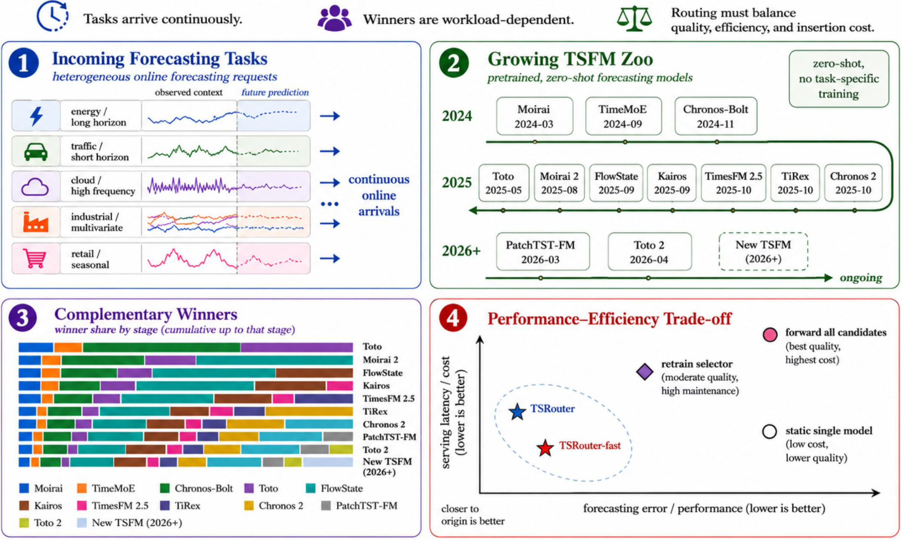

# TSRouter-VLDB

This repository contains the public implementation and reproduction package for TSRouter and TSFM-ZooBench.

**Release:** `v1.0`

Time-series foundation models (TSFMs) are increasingly deployed as a shared model zoo rather than selected once for a fixed benchmark. In that setting, a forecasting service must select a model for each incoming request while the zoo grows and new model evidence becomes available. TSRouter addresses this problem with a capability index that represents model behavior across time-series contexts, enabling efficient request-level ranking without evaluating every candidate model for every request.

TSRouter exposes three operations for maintaining and using the index:

- **PROFILE** builds capability representations from model evidence.
- **ROUTE** ranks candidate models for a forecasting request.
- **INSERT** updates the index when a new model or new result is registered.

TSFM-ZooBench extends a standard forecasting workload into this evolving-service setting. It uses GIFT-Eval as its public forecasting workload, then adds an ordered TSFM registry, capability profiling, request-level routing, and model-arrival evaluation. The repository includes the method implementation, paper baseline implementations, workflow commands, and reproduction materials.

## Overview



*Figure 1: Why quality-efficiency routing is needed in a growing TSFM zoo. A multi-tenant forecasting service receives heterogeneous time-series requests while the candidate TSFM repository expands over time. Release-ordered winner shares show that request ownership is distributed across models and shifts after new arrivals. Full-zoo forwarding and selector retraining become increasingly costly as the zoo grows, motivating adaptive routing that balances forecasting accuracy, serving latency, and INSERT maintenance time.*

## Artifacts

[**TSRouter-VLDB Artifacts on Hugging Face**](https://huggingface.co/datasets/LAMDA-shihn/tsrouter-v1-artifacts)

The artifact repository provides released result records, capability representations, request-sample caches, profile inputs, and table inputs. The forecasting workload is available from the [official GIFT-Eval repository](https://huggingface.co/datasets/Salesforce/GiftEval).

## License

TSRouter-VLDB code is licensed under [Apache-2.0](LICENSE). Benchmark, model, checkpoint, and artifact terms are described in [THIRD_PARTY_NOTICES.md](THIRD_PARTY_NOTICES.md) and their original public sources.

## TSFM Registry

The model zoo contains 20 registered TSFM variants ordered by public release date. Abbreviations are used consistently by the workflow outputs and result tables. The machine-readable registry is maintained in [`configs/model_registry.yaml`](configs/model_registry.yaml).

| Stage | TSFM family | Abbreviation | Registered version / size | Release date |
| ---: | --- | --- | --- | --- |
| 1 | Moirai | `Moi.S` | [1.0-R-small](https://huggingface.co/Salesforce/moirai-1.0-R-small) | 2024-03 |
| 2 | Moirai | `Moi.B` | [1.0-R-base](https://huggingface.co/Salesforce/moirai-1.0-R-base) | 2024-03 |
| 3 | Moirai | `Moi.L` | [1.0-R-large](https://huggingface.co/Salesforce/moirai-1.0-R-large) | 2024-03 |
| 4 | TimeMoE | `TMoE.50` | [50M](https://huggingface.co/Maple728/TimeMoE-50M) | 2024-09 |
| 5 | Chronos | `Chr.bT` | [bolt-tiny](https://huggingface.co/amazon/chronos-bolt-tiny) | 2024-11 |
| 6 | Chronos | `Chr.bM` | [bolt-mini](https://huggingface.co/amazon/chronos-bolt-mini) | 2024-11 |
| 7 | Chronos | `Chr.bS` | [bolt-small](https://huggingface.co/amazon/chronos-bolt-small) | 2024-11 |
| 8 | Chronos | `Chr.bB` | [bolt-base](https://huggingface.co/amazon/chronos-bolt-base) | 2024-11 |
| 9 | Toto | `Toto` | [Toto-Open-Base-1.0](https://huggingface.co/Datadog/Toto-Open-Base-1.0) | 2025-05 |
| 10 | Moirai 2 | `Moi2.S` | [2.0-R-small](https://huggingface.co/Salesforce/moirai-2.0-R-small) | 2025-08 |
| 11 | FlowState | `Flo.r1` | [r1](https://huggingface.co/ibm-granite/granite-timeseries-flowstate-r1) | 2025-09 |
| 12 | Kairos | `Kai.10` | [10M](https://huggingface.co/mldi-lab/Kairos_10m) | 2025-09 |
| 13 | Kairos | `Kai.23` | [23M](https://huggingface.co/mldi-lab/Kairos_23m) | 2025-09 |
| 14 | Kairos | `Kai.50` | [50M](https://huggingface.co/mldi-lab/Kairos_50m) | 2025-09 |
| 15 | TimesFM | `TFM.25` | [2.5-200M](https://huggingface.co/google/timesfm-2.5-200m-pytorch) | 2025-10 |
| 16 | TiRex | `TiRex` | [1.1](https://huggingface.co/NX-AI/TiRex-1.1-gifteval) | 2025-10 |
| 17 | Chronos 2 | `Chr.2` | [base](https://huggingface.co/amazon/chronos-2) | 2025-10 |
| 18 | PatchTST-FM | `PTS.FM` | [r1](https://huggingface.co/ibm-granite/granite-timeseries-patchtst-fm-r1) | 2026-03 |
| 19 | Toto 2 | `Toto2.T` | [2.0-4M](https://huggingface.co/Datadog/Toto-2.0-4m) | 2026-04 |
| 20 | Toto 2 | `Toto2.S` | [2.0-22M](https://huggingface.co/Datadog/Toto-2.0-22m) | 2026-04 |

## Setup

Clone the repository and enter its root directory:

```bash
git clone https://github.com/fireball0213/TSRouter-VLDB.git
cd TSRouter-VLDB
```

Create the validated Linux GPU environment:

```bash
conda env create -f environment-linux-gpu.yml
conda activate tsrouter-v1
python scripts/check_environment.py --require-gpu --strict
```

The validated configuration uses Python 3.11.15, PyTorch 2.5.1, and CUDA 12.4. The `results` and `route` levels do not require a GPU; the `core` level requires a CUDA-capable environment.

To install only the lightweight dependencies for artifact checks and table preview:

```bash
python -m pip install -r requirements_core.txt
```

Install the method dependencies for TSFM and selector components:

```bash
python -m pip install -r requirements_method.txt
```

The released workflows use the appropriate inputs and results for their selected reproduction level. When a workflow requires local checkpoints or GIFT-Eval, its preflight check reports the required location.

On a connected machine, prefetch the official model checkpoints and benchmark:

```bash
python scripts/fetch_model_weights.py --out "$PWD/checkpoints"
python scripts/fetch_gifteval.py --out "$PWD/data/gifteval"
```

Use `--model <family_variant>` with `fetch_model_weights.py` to retrieve selected checkpoints. The script records the downloaded upstream revisions in `checkpoints/checkpoint_manifest.json`. Access controls and license terms of each upstream model repository remain applicable.

Set the artifact repository:

```bash
export TSROUTER_VLDB_HF_REPO="LAMDA-shihn/tsrouter-v1-artifacts"
```

## Reproduction Levels

The `--reuse` level selects a reproducible scope and its required inputs:

| Level | Recomputed work | Required downloads |
| --- | --- | --- |
| `results` | Artifact validation and table preview | TSRouter artifact repository only |
| `route` | TSRouter main and fast routing from released capability representations and request-sample caches | TSRouter artifact repository only |
| `core` | TSRouter capability profiling followed by main and fast routing | TSRouter artifact repository, [GIFT-Eval](https://huggingface.co/datasets/Salesforce/GiftEval), and the official TSFM checkpoints |

The `results` level is the fastest way to inspect the released paper outputs. The `route` level is the recommended quick method check: it reuses released capability representations, pooled inputs, request-sample caches, and TSFM metric records, then recomputes the routing decisions without loading benchmark data or model checkpoints. The `core` level rebuilds the capability representations with the public benchmark and official checkpoints, while reusing the released TSFM metric records and request-sample cache.

All levels write JSON logs to `reproduction_logs/`. Commands that produce tables write them to `results_csv/TSRouter/vldb/tables/`.

## Results Check

To validate the released result package and preview the tables:

```bash
bash scripts/run_public_reproduction.sh \
  --root "$PWD" \
  --python-bin "$(which python)" \
  --reuse results \
  --pull \
  --repo-id "$TSROUTER_VLDB_HF_REPO"
```

## Route Check

To rerun the TSRouter main and fast route decisions from released representations and request samples:

```bash
bash scripts/run_public_reproduction.sh \
  --root "$PWD" \
  --python-bin "$(which python)" \
  --reuse route \
  --pull \
  --repo-id "$TSROUTER_VLDB_HF_REPO"
```

## Core Check

Download the public benchmark and official checkpoints on a connected machine:

```bash
python scripts/fetch_gifteval.py --out "$PWD/data/gifteval"
python scripts/fetch_model_weights.py --out "$PWD/checkpoints"
```

Then rebuild TSRouter capability representations and route decisions:

```bash
bash scripts/run_public_reproduction.sh \
  --root "$PWD" \
  --checkpoint-root "$PWD/checkpoints" \
  --python-bin "$(which python)" \
  --reuse core \
  --pull \
  --repo-id "$TSROUTER_VLDB_HF_REPO"
```

## Command Groups

The workflow can also be run one command group at a time:

```bash
python src/cli/tsrouter_vldb.py profile run --stage 20 --variant main,fast --reuse core --execute --workspace-root "$PWD" --python-bin "$(which python)"
python src/cli/tsrouter_vldb.py route run --stage 20 --variant main,fast --reuse route --execute --workspace-root "$PWD" --python-bin "$(which python)"
python src/cli/tsrouter_vldb.py insert run --stage 20 --variant main,fast --reuse core --execute --workspace-root "$PWD" --python-bin "$(which python)"
python src/cli/tsrouter_vldb.py summary tables --stage 20 --reuse results --execute --workspace-root "$PWD" --python-bin "$(which python)"
```

Use `--reuse results` to validate released outputs, `--reuse route` for cache-driven route checks, and `--reuse core` when rebuilding the capability profile.

`--stage N` selects a model-arrival stage for index construction, routing, insertion, and table generation. PROFILE source preparation is shared across stages. For an INSERT range, use `--start-stage A --end-stage B`.
